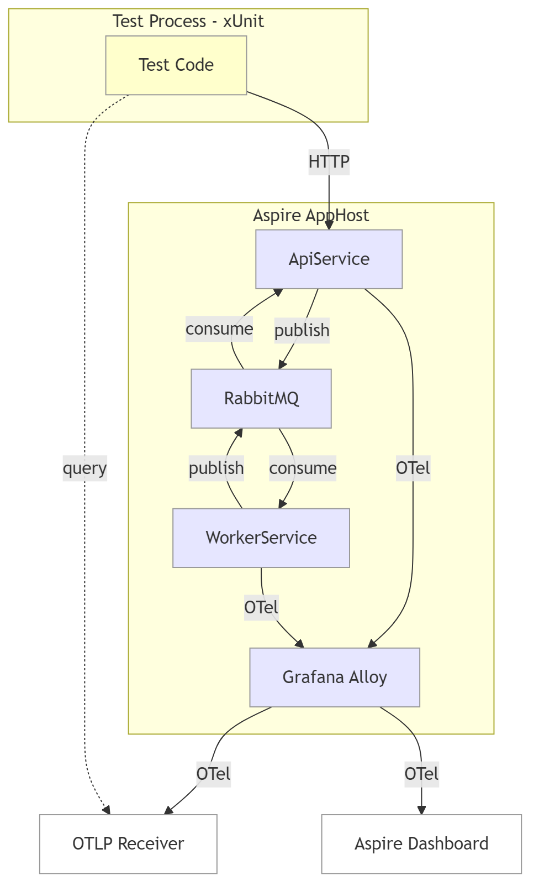

# Aspire OTel Test Harness

Capture OpenTelemetry logs, traces, and metrics from **out-of-process** Aspire resources during integration tests.

## The Problem

With `DistributedApplicationTestingBuilder`, worker service logs are invisible — they run as separate processes and their telemetry goes nowhere useful. When a message handler fails or a saga chain breaks, you're debugging blind.

## The Solution

Route all OTel through **[Grafana Alloy](https://grafana.com/oss/alloy-opentelemetry-collector/)** (an OpenTelemetry Collector distribution) and fan it out to an **in-process OTLP receiver** that the test code can query directly.



Each xUnit test gets its own trace span. Trace context propagates through HTTP calls **and** RabbitMQ messages, so the test can filter by trace ID to see only its own request chain across all services.

## Features

| Feature | Details |
|---------|---------|
| **OTel forwarding** | Logs (Info+), traces, and metrics from all resources flow through Alloy to the test receiver. Silently no-ops when `EXTERNAL_OTEL_ENDPOINT` isn't set. |
| **Dual Alloy configs** | `alloy-config.default.alloy` routes to the Aspire Dashboard only. `alloy-config.external.alloy` adds immediate batch forwarding (`timeout=0s`, `send_batch_size=1`) to an external receiver. Selected automatically based on `EXTERNAL_OTEL_ENDPOINT`. |
| **Minimized export delays** | `OTEL_BSP_SCHEDULE_DELAY`, `OTEL_BLRP_SCHEDULE_DELAY`, and `OTEL_METRIC_EXPORT_INTERVAL` set to 1ms when an external endpoint is configured, eliminating SDK-side batching latency. |
| **Trace correlation** | Per-test spans via [PracticalOtel.xUnit.v3](https://github.com/practical-otel/dotnet-xunit-otel). Full distributed trace across HTTP and message broker hops. |
| **Per-test trace dump** | `IAsyncLifetime.DisposeAsync` waits for trace-correlated data to stabilize (poll-until-stable), then dumps the full trace chain to `TestOutputHelper` **and** writes it to `_Logs/{TestMethod}.testlog` next to the test source. Also follows `ActivityLink`s to include any downstream trace linked back to the test's trace (e.g. the deferred-dispatch trace demonstrated below). Runs on pass **and** fail. |
| **Deferred-dispatch correlation** | `DeferredDispatcher` background service drains an in-memory work store on a 500ms tick and publishes commands under a fresh `ActivityKind.Producer` span that starts a new trace and carries an `ActivityLink` back to the enqueue-time trace. Matches [OTel messaging semantic conventions](https://opentelemetry.io/docs/specs/semconv/messaging/messaging-spans/) — links, not parent-child, for producer↔consumer correlation in async/batch scenarios. Bounded per-dispatch trace lifetimes; downstream handlers run under the Producer's new trace via Wolverine traceparent propagation. |
| **Correlation-attribute filtering** | Dispatcher stamps `enqueue.trace_id` and `deferred_work.item_id` as span attributes so tests can filter work by attribute (`WaitForSpansByAttributeAsync`) without depending on trace-structure assumptions. Keeps test assertions stable if the dispatcher's correlation strategy evolves later. |
| **Message chain tracing** | Full round-trip: API publishes command → RabbitMQ → Worker processes → publishes result → RabbitMQ → API receives. Every log carries the originating test's trace ID. |
| **Console log capture** | Resource stdout/stderr via `ResourceLoggerService.WatchAsync()`. Catches startup crashes before OTel initializes. |
| **Error span capture** | `OtlpSpan` parses status code, status message, span events (including exception type/message/stacktrace), and attributes. `FormatTraceChain` shows `ERROR` tags with exception details on failed spans. |
| **Span link parsing** | `OtlpSpan.Links` carries parsed `OtlpSpanLink` records (`TraceId`, `SpanId`, `Attributes`). `FormatTraceChain` renders `Linked: trace=... span=...` lines, making producer↔consumer correlation visible in `.testlog` output. |
| **Diagnostics** | `GetDiagnosticSummary()` on failure, `FormatTraceChain(traceId)` for visualization, `FinalStateLoggerService` for shutdown state. |
| **Predicate filtering** | `GetLogRecords(l => l.Body?.Contains("error") == true)` — filter by resource, severity, content, trace ID. |
| **Structured attributes** | Log record attributes parsed from OTLP JSON — filter by structured fields (e.g., `l.Attributes["ItemId"]`) instead of string-matching the body. |
| **CancellationToken support** | All `WaitFor*Async` methods accept `CancellationToken` as the primary API, integrating with xUnit's `TestContext.Current.CancellationToken` for responsive test cancellation. |
| **Severity filtering** | Alloy drops Debug/Trace-level logs (`severity_number < 9`) before forwarding, keeping the receiver focused on actionable output. |

## Tests

| Test | Proves |
|------|--------|
| `WorkerLogs_AreForwarded` | Out-of-process worker logs arrive at the receiver |
| `ApiLogs_AreForwarded_OnHttpRequest` | API request logs flow through Alloy |
| `Logs_CanBeFiltered_ByResourceName` | Filter by service name |
| `Logs_CanBeFiltered_ByPredicate` | Filter by severity, message content, any field |
| `Traces_AreCorrelated_AcrossServices` | HTTP trace context propagates end-to-end |
| `Metrics_AreForwarded` | Runtime/ASP.NET metrics arrive at the receiver |
| `ConsoleLogs_AreCaptured` | Raw stdout/stderr captured per resource |
| `DebugLogs_AreFilteredByAlloy` | Debug-level logs are dropped by Alloy's severity filter |
| `MessageChain_IsTraceable` | Full round-trip (API → Worker → API) shares one trace ID |
| `HandlerException_RetriesAreVisible_InTracesAndLogs` | Handler failures produce error spans (per-execution) and error logs (per-attempt) visible through OTel |
| `DeferredDispatch_CorrelatesToEnqueueTraceViaActivityLink` | Work enqueued under trace A and dispatched by a background tick correlates back to A via an `ActivityLink` on the dispatcher's `Producer` span — the handler runs under a new bounded trace linked to the enqueuer |
| `DeferredDispatch_FindableByEnqueueTraceIdAttribute` | Dispatched work is discoverable via `enqueue.trace_id` attribute alone, without depending on trace-structure assumptions |

## Project Structure

```
src/
  AppHost/                   Aspire orchestrator + Grafana Alloy config
    Grafana/
      alloy-config.default.alloy    Aspire Dashboard sink only
      alloy-config.external.alloy   External receiver + immediate batch forwarding
  ApiService/                REST API + Wolverine publisher
  WorkerService/             Background service + Wolverine handlers
    DeferredWorkStore.cs         In-memory queue of commands awaiting dispatch
    DeferredDispatcher.cs        BackgroundService that drains the store under a
                                 new Producer span with ActivityLink to enqueuer
    Handlers/
      ScheduleItemCommandHandler.cs   Captures enqueue-time traceparent + stores
      ProcessItemCommandHandler.cs    Processes dispatched work
      ProcessItemFailCommandHandler.cs
  ServiceDefaults/           Shared OTel config (adds "DeferredDispatcher" source) + messages
test/
  Tests.Integration/         12 integration tests + OTLP receiver infrastructure
    Infrastructure/
      OtlpReceiver.cs              HTTP receiver + span-link parsing + attribute filters
      OtlpTestFixture.cs           Shared fixture (AppHost + receiver + console log capture)
      OtelPipelineStartup.cs       Per-test trace spans via PracticalOtel.xUnit.v3
      AppHostExtensions.cs         WithTestingDefaults() logging/filter config
      FinalStateLoggerService.cs   Resource-state dump on shutdown
      TestLogWriter.cs             Writes _Logs/{TestMethod}.testlog next to test source
    _Logs/                      Per-test trace-chain output (written on pass and fail)
```

## How It Works

1. `OtlpTestFixture` starts an OTLP HTTP receiver on a dynamic port
2. AppHost starts with `--EXTERNAL_OTEL_ENDPOINT=http://host.docker.internal:{port}`
3. `AddGrafanaAlloy()` detects `EXTERNAL_OTEL_ENDPOINT` and selects `alloy-config.external.alloy` with immediate batch forwarding; without it, `alloy-config.default.alloy` routes only to the Aspire Dashboard
4. `WithAppForwarding()` auto-sets `OTEL_EXPORTER_OTLP_ENDPOINT` on all resources → Alloy, and minimizes SDK batch delays when an external endpoint is configured
5. Resources start in dependency order: Alloy + RabbitMQ → WorkerService → ApiService
6. `TracedPipelineStartup` creates a span per test; HTTP/Wolverine propagate trace context
7. Test queries receiver by resource name, predicate, attribute, or trace ID
8. `IAsyncLifetime.DisposeAsync` waits for trace-correlated data to stabilize, then dumps the full trace chain to `TestOutputHelper` **and** to `_Logs/{TestMethod}.testlog` next to the test source — also following `ActivityLink`s to include any downstream traces the test caused. Runs on pass and fail.
9. On teardown: `FinalStateLoggerService` logs resource state, `GetDiagnosticSummary()` dumps collected telemetry

### Deferred Dispatch

Demonstrates correlating deferred / queue-backed work back to its enqueuer without inheriting the dispatcher tick's ambient trace.

**The problem this solves.** When a background service drains a queue on a timer and publishes a message, the default behavior of most instrumentation (including Wolverine's `OutgoingContextMiddleware`) is to capture `Activity.Current` at publish time and stamp it on the outgoing envelope. The downstream handler then inherits *the dispatcher tick's trace*, not the trace under which the work was originally enqueued. In parallel test runs or busy production systems, this means a unit of work scheduled by request A may show up in request B's trace purely because B's dispatch tick happened to pick it up. Trace-based investigation becomes ambiguous.

**How this harness demonstrates a fix.**

`POST /schedule` enqueues a `ScheduleItemCommand` under the HTTP request's trace (call it trace A). The worker's `ScheduleItemCommandHandler` captures `Activity.Current.Id` as the enqueue-time traceparent and stores a `ProcessItemCommand` in the in-memory `DeferredWorkStore`. A `DeferredDispatcher` `BackgroundService` drains the store every 500ms. For each entry:

1. Parse the stored traceparent into an `ActivityContext`.
2. Start a fresh `ActivityKind.Producer` span `DeferredDispatcher.Publish` on a **new root trace**, with `ActivityLink(enqueuerContext)` back to A.
3. Stamp `enqueue.trace_id` + `deferred_work.item_id` span attributes on the Producer span.
4. Call `bus.PublishAsync` inside the Producer scope → Wolverine stamps the Producer's new traceparent on the envelope.

The downstream `ProcessItemCommandHandler` runs under the Producer's new trace (as its child, via Wolverine traceparent propagation). The handler's trace is therefore **bounded** to this dispatch — avoiding the unbounded-lifetime problem that arises when a queued item is parented to a long-lived request trace — while the `ActivityLink` preserves correlation back to whoever originally enqueued. This matches the OTel spec's guidance that async/batch producer↔consumer correlation should use span links rather than parent-child relationships.

Each `.testlog` file contains both the test's own trace chain and any downstream dispatch trace chain, with a `-- linked downstream trace --` separator and `Linked: trace=... span=...` annotations on the Producer span, making the full lifecycle visible in one file.

## Why Not WebApplicationFactory?

`WebApplicationFactory` (WAF) runs the service in-process, which seems simpler but undermines what this harness validates:

- **OTel SDK ignores DI configuration for exporter endpoints.** The SDK reads `OTEL_EXPORTER_OTLP_ENDPOINT` from environment variables at options construction time. `ConfigureAll<OtlpExporterOptions>` and `PostConfigure` don't reliably override them, forcing fragile env var save/restore hacks.
- **Trace context doesn't propagate through TestServer.** WAF's in-memory HTTP handler doesn't propagate `Activity.Current` the same way a real HTTP client does. Per-test trace correlation — the core feature of this harness — breaks.
- **Competing consumers on shared queues.** The WAF's Wolverine instance listens on the same RabbitMQ queues as the out-of-process service, making message delivery non-deterministic.
- **Metric export timing.** A freshly started WAF hasn't flushed metrics yet (default interval ~60s), requiring inflated timeouts.
- **It tests the wrong thing.** The whole point is proving telemetry flows through the real infrastructure — Alloy, RabbitMQ, separate processes. WAF removes exactly the parts you're trying to validate.

WAF is the right tool for controller unit tests and DI integration tests. For end-to-end OTel pipeline validation, `DistributedApplicationTestingBuilder` with out-of-process resources is the correct approach.

## Quick Start

```bash
dotnet test                          # run all tests
dotnet run --project src/AppHost     # run standalone with dashboard
```

> Requires .NET 10 SDK and Docker Desktop

## Acknowledgments

Built with [Claude Code](https://claude.ai/claude-code) by Anthropic.

Inspired by:
- [Aspire Community Toolkit](https://github.com/CommunityToolkit/Aspire) — `WithAppForwarding()` pattern
- [aspire-otel-testing](https://github.com/afscrome/aspire-otel-testing) by [@afscrome](https://github.com/afscrome) — resource log streaming, `FinalStateLoggerService`
- [dotnet-xunit-otel](https://github.com/practical-otel/dotnet-xunit-otel) by [Practical OpenTelemetry](https://github.com/practical-otel) — per-test trace spans
