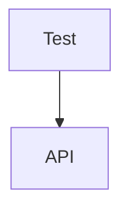

# Aspire OTel Test Harness

Capture OpenTelemetry logs, traces, and metrics from **out-of-process** Aspire resources during integration tests.

## The Problem

With `DistributedApplicationTestingBuilder`, worker service logs are invisible — they run as separate processes and their telemetry goes nowhere useful. When a message handler fails or a saga chain breaks, you're debugging blind.

## The Solution

Route all OTel through **[Grafana Alloy](https://grafana.com/oss/alloy-opentelemetry-collector/)** (an OpenTelemetry Collector distribution) and fan it out to an **in-process OTLP receiver** that the test code can query directly.



Each xUnit test gets its own trace span. Trace context propagates through HTTP calls **and** RabbitMQ messages, so the test can filter by trace ID to see only its own request chain across all services.

## Features

| Feature | Details |
|---------|---------|
| **OTel forwarding** | Logs (Info+), traces, and metrics from all resources flow through Alloy to the test receiver. Silently no-ops when `EXTERNAL_OTEL_ENDPOINT` isn't set. |
| **Trace correlation** | Per-test spans via [PracticalOtel.xUnit.v3](https://github.com/practical-otel/dotnet-xunit-otel). Full distributed trace across HTTP and message broker hops. |
| **Message chain tracing** | Full round-trip: API publishes command → RabbitMQ → Worker processes → publishes result → RabbitMQ → API receives. Every log carries the originating test's trace ID. |
| **Console log capture** | Resource stdout/stderr via `ResourceLoggerService.WatchAsync()`. Catches startup crashes before OTel initializes. |
| **Diagnostics** | `GetDiagnosticSummary()` on failure, `FormatTraceChain(traceId)` for visualization, `FinalStateLoggerService` for shutdown state. |
| **Predicate filtering** | `GetLogRecords(l => l.Body?.Contains("error") == true)` — filter by resource, severity, content, trace ID. |

## Tests

| Test | Proves |
|------|--------|
| `WorkerLogs_AreForwarded` | Out-of-process worker logs arrive at the receiver |
| `ApiLogs_AreForwarded_OnHttpRequest` | API request logs flow through Alloy |
| `Logs_CanBeFiltered_ByResourceName` | Filter by service name |
| `Logs_CanBeFiltered_ByPredicate` | Filter by severity, message content, any field |
| `Traces_AreCorrelated_AcrossServices` | HTTP trace context propagates end-to-end |
| `Metrics_AreForwarded` | Runtime/ASP.NET metrics arrive at the receiver |
| `ConsoleLogs_AreCaptured` | Raw stdout/stderr captured per resource |
| `MessageChain_IsTraceable` | Full round-trip (API → Worker → API) shares one trace ID |

## Project Structure

```
src/
  AppHost/                   Aspire orchestrator + Grafana Alloy config
  ApiService/                REST API + Wolverine publisher
  WorkerService/             Background service + Wolverine handlers
  ServiceDefaults/           Shared OTel config + message types
  Web/                       Blazor frontend (Aspire template)
test/
  Tests.Integration/         8 integration tests + OTLP receiver infrastructure
```

## How It Works

1. `OtlpTestFixture` starts an OTLP HTTP receiver on a dynamic port
2. AppHost starts with `--EXTERNAL_OTEL_ENDPOINT=http://host.docker.internal:{port}`
3. `WithAppForwarding()` auto-sets `OTEL_EXPORTER_OTLP_ENDPOINT` on all resources → Alloy
4. Alloy fans out to Aspire Dashboard + test receiver
5. `TracedPipelineStartup` creates a span per test; HTTP/Wolverine propagate trace context
6. Test queries receiver by resource name, predicate, or trace ID
7. On teardown: `FinalStateLoggerService` logs resource state, `GetDiagnosticSummary()` dumps collected telemetry

## Quick Start

```bash
dotnet test                          # run all tests
dotnet run --project src/AppHost     # run standalone with dashboard
```

> Requires .NET 10 SDK and Docker Desktop

## Acknowledgments

Built with [Claude Code](https://claude.ai/claude-code) by Anthropic.

Inspired by:
- [Aspire Community Toolkit](https://github.com/CommunityToolkit/Aspire) — `WithAppForwarding()` pattern
- [aspire-otel-testing](https://github.com/afscrome/aspire-otel-testing) by [@afscrome](https://github.com/afscrome) — resource log streaming, `FinalStateLoggerService`
- [dotnet-xunit-otel](https://github.com/practical-otel/dotnet-xunit-otel) by [Practical OpenTelemetry](https://github.com/practical-otel) — per-test trace spans
